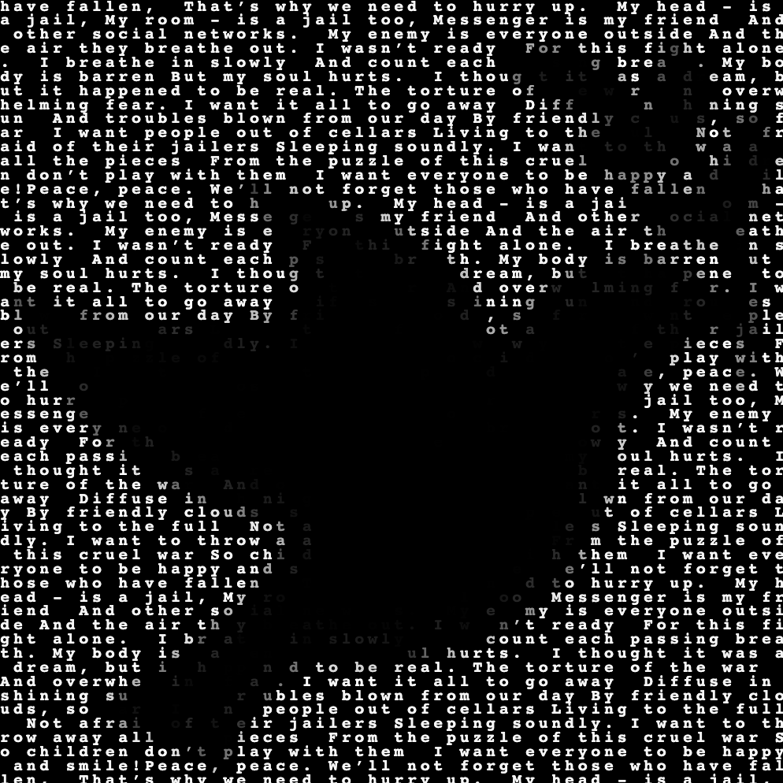

# Software Art: Text 

Exploring the possibility to make image using text


## Conceptual background

The goal of the project was to build on the ways explored in class to come up with art pieces using text. To begin the project, I obtained the most discussed topics (war, identity etc) in the r/news subreddit. From that, I searched for ways to come up with art pieces that would have a stronger effect in the audience, to convey the message of the happening in the world.

## Implementation

### Happenings
- Extracted the data from reddit r/worldnews using the reddit API
- Cleaned the data to remove the links, randomly placed number codes
- Then using the titles of the reddit page, genereated a worldcloud of the most frequently occuring words
- Gives the words being used in the context

### Interaction

- Using p5.js took the webcam video input
- Looped through each of the pixel of the input data and calculated the average of each pixel 
- Calculated the difference between the neighbouring pixel and found the value 
- Compared the obtained value with a threshold and pring the text grey if above the threshold (in our case 20)


### Peace


### Example Output

```
====================

Peace, 
Where are you? Oh, that my heart yearns for!
Oh, lost springs, oh my beloved country at peace that I pray for
Your voice is the remedy of so many souls
Of a painful mother, of a crying child and countless more
You are the peaceful soul. "Once again, every child shall have a pen in their hand. I was born and raised in conflict, but I hope to see my country free from conflict." Life will be extremely beautiful when

====================

Peace, peace.
We’ll not forget those who have fallen, 
That’s why we need to hurry up.
 My head - is a jail,
My room - is a jail too,
Messenger is my friend 
And other social networks.

My enemy is everyone outside
And the air they breathe out.
I wasn’t ready 
For this fight alone.

I breathe in slowly 
And count each passing breath

====================

Peace, peace.
We’ll not forget those who have fallen, 
That’s why we need to hurry up.
 My head - is a jail,
My room - is a jail too,
Messenger is my friend 
And other social networks.

My enemy is everyone outside
And the air they breathe out.
I wasn’t ready 
For this fight alone.

I breathe in slowly 
And count each passing breath
====================
```


<!--  -->

 
